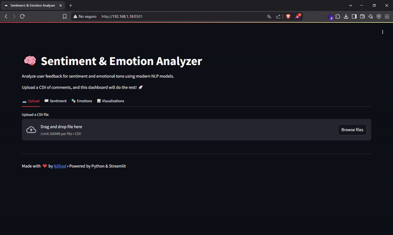
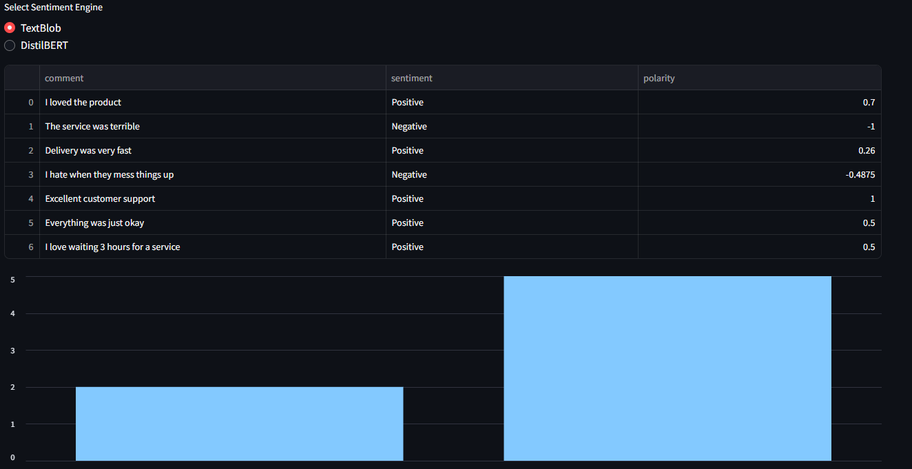
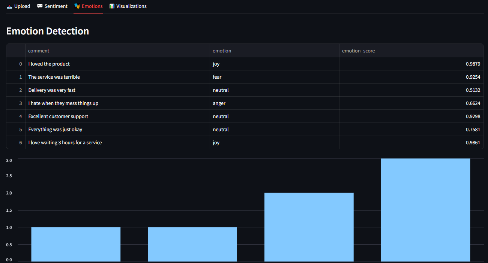

# 🧠 Sentiment & Emotion Analyzer


A modern, interactive dashboard built with Python and Streamlit to analyze user feedback through **sentiment analysis** and **emotion detection**, using both classical and transformer-based NLP models.



---

## 📚 Table of Contents

- [Features](#-features)
- [Tech Stack](#-tech-stack)
- [Screenshot](#-screenshot)
- [How it Works](#-how-it-works)
- [File Format](#-file-format)
- [Installation](#-installation)
- [Deployment](#-deployment)
- [Behind the Scenes](#-behind-the-scenes)
- [Roadmap](#-roadmap--to-do)
- [License](#-license)
- [Author](#-author)

---

## 🚀 Features

- 📤 Upload a CSV file with user comments
- 💬 Analyze sentiment using:
  - TextBlob (lightweight rule-based)
  - DistilBERT (transformer-based)
- 🎭 Detect emotions: joy, anger, sadness, fear, surprise, neutral
- 📊 Visualize results with bar charts and word clouds
- 📥 Download enriched data as CSV

---

## 🧰 Tech Stack

- **Python**
- **Streamlit** – for UI
- **TextBlob** – basic sentiment analysis
- **HuggingFace Transformers** – DistilBERT and DistilRoBERTa models
- **Pandas** – data manipulation
- **Matplotlib** & **WordCloud** – data visualization

---

## 🧪 How it Works

1. Upload your CSV file  
   

2. Select the analysis engine  
   

3. View sentiment and emotion results  
   

---

## 📂 File Format

Make sure your CSV has at least one column named **`comment`** containing user-generated text.

```csv
comment
I love the product!
Terrible service, very disappointed.
It was okay, nothing special.
```

---

## 🔧 Installation

1. **Clone the repository**

```bash
git clone https://github.com/nilfredb/Sentiment-Emotion-analyzer.git
cd sentiment-dashboard
```

2. **Create and activate a virtual environment**

```bash
python -m venv venv
source venv/bin/activate  # On Windows: venv\Scripts\activate
```

3. **Install the dependencies**

```bash
pip install -r requirements.txt
python -m textblob.download_corpora
```

4. **Run the app**

```bash
streamlit run app.py
```

---

## ☁️ Deployment

You can deploy it easily using:
- [Streamlit Cloud](https://share.streamlit.io/)
- [Render](https://render.com)
- [Hugging Face Spaces](https://huggingface.co/spaces)

---

## 🧠 Behind the Scenes

- Sentiment analysis uses both rule-based (TextBlob) and deep learning (DistilBERT) engines.
- Emotion detection is powered by a fine-tuned DistilRoBERTa model trained on English emotions.
- The UI is built with Streamlit using tabs, expanders, and interactive charts.
- Results are saved dynamically and exportable as CSV.

---

## 📅 Roadmap / To Do

- [ ] Add sarcasm detection module
- [ ] Export results to PDF
- [ ] Allow manual text input (single comment mode)
- [ ] Add confidence color-coding in tables
- [ ] Deploy to HuggingFace Spaces

---

## 📄 License

This project is open-source under the **MIT License**.

---

## 🙌 Author

Made with ❤️ by [Nilfred Báez](https://github.com/nilfredb)
Interested in collaboration, hiring, or feedback?
[📧 Email](mailto:nbaez414@gmail.com)

> If you found this useful, give it a ⭐ on GitHub!